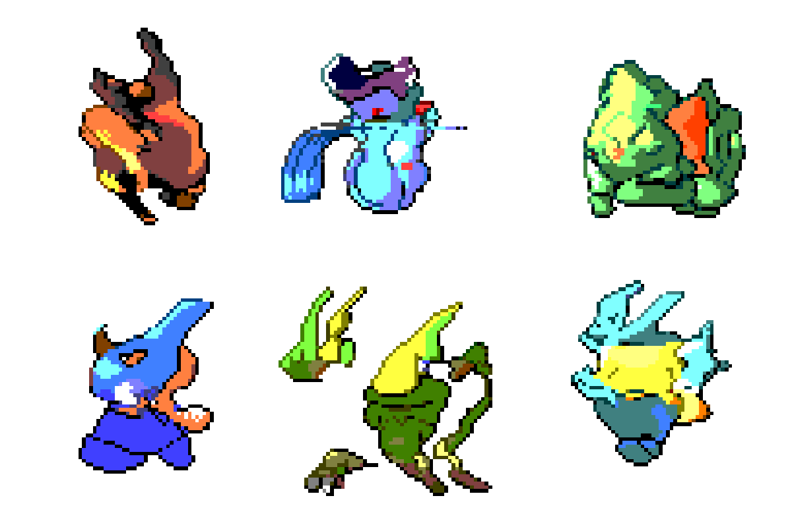
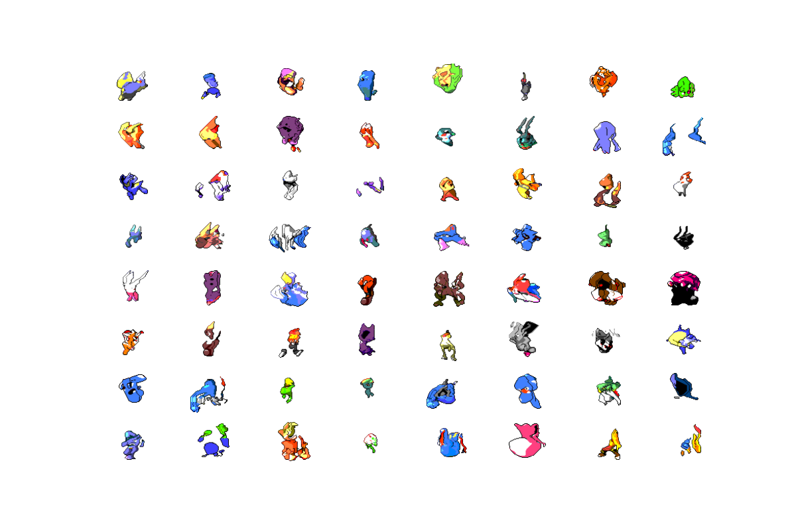
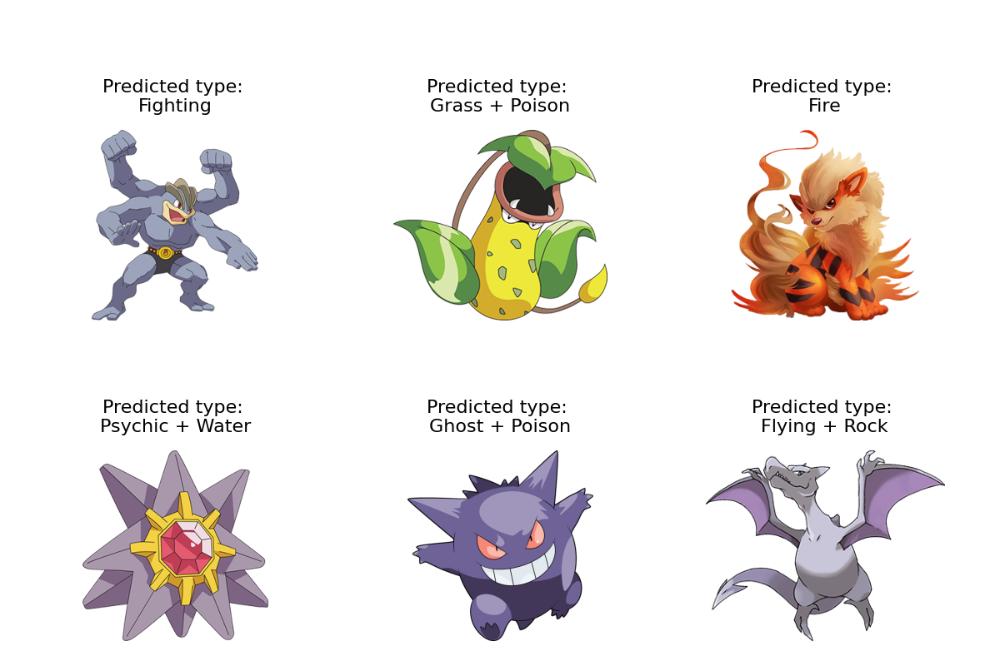

# PokéPredict
A collection of models related to various aspects of Pokémon.
* [Creates](#generate-pokémon) new Pokémon from images of pre-existing in PyTorch by training a deep convolutional generative adversarial network (DCGAN)
* [Predicts](#image-classification) Pokémon’s type from input image using multi-label classification in TensorFlow and Keras with a convolutional neural network (CNN)
* [Classifies](#legendary-prediction) legendary status of Pokémon based on its other statistics

## Generate Pokémon
Creating new Pokémon from images of pre-existing ones using a generative adversarial network (GAN).
Model uses the DCGAN architecture, where both generator and discriminator are CNNs, based on the paper [*Generative Adversarial Networks*](https://arxiv.org/abs/1406.2661) by Ian Goodfellow et al.
Model was trained for 50 epochs, with results saved at each step, and required much tuning. 

Some hand-picked and cleaned examples of generated Pokémon produced by the model:

The notebooks for this section are located at [/generate_new](/generate_new).

## Image Classification
Multi-label classification of a Pokémon’s type based on an input image. 
The model uses the EfficientNetB0 architecture, with early stopping and reducing learning rate on a plateau, trained for 19 epochs.
Using test images from the first 151 Pokémon, the model achieves an area under the ROC curve very close to one.

Some examples of type predictions by the model (all are correct):

The notebooks for this section are located at [/type_classification](/type_classification).

## Legendary Prediction
A collection of models classifying the status (legendary, sub-legendary, mythical, normal) of Pokémon based on statistics like attack, defense, type, egg cycles, etc. 

Our most successful models are Random Forests achieving accuracies of ~99%, with logistic regression, neural networks, and SVMs being other models that achieved 95%+ accuracy.
The most useful features for discerning the legendary status are the number of egg cycles, the base experience, and the catch rate. 

The notebooks for this section are located at [/legendary_status](/legendary_status).

## Getting Started
How to run the application

1. Clone the repository.
2. Edit and rerun the Jupyter Notebooks as desired.

## Data Sources
* [Complete Pokemon Dataset](https://www.kaggle.com/mariotormo/complete-pokemon-dataset-updated-090420)
* [Pokemon Image Dataset](https://www.kaggle.com/vishalsubbiah/pokemon-images-and-types)
* [Pokemon Images](https://www.kaggle.com/dollarakshay/pokemon-images)
* [7,000 Labeled Pokemon](https://www.kaggle.com/lantian773030/pokemonclassification)

## Built With
* [PyTorch](https://pytorch.org/) - Deep Learning
* [TensorFlow](https://www.tensorflow.org/) - Deep Learning

## License
This project is licensed under the MIT License - see [LICENSE](LICENSE) file for details.
